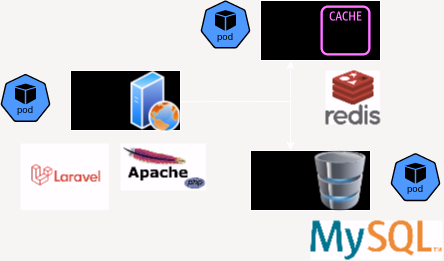

# Introduction

The main objective is to deploy/package a laravel based application as a helm chart, and create a pipeline for it, the application is a simple blog post creation webapp.
The application consists of three main components:

 - Laravel application (PHP running in a Apache 2.x container).
 - MySQL Database used as a DB backend.
 - Caching layer (Redis).

 
 The helm chart is under the ./chart directory
 The Gitlab CI file is under ./gitlab-ci.yml
 The .env file is configured as a Kubernetes ConfigMap File

# Prerequisites

 - Kubernetes Cluster v1.2x 
 - Git 
 - Helm 3.x 
 - Gitlab CI
 - PHP 8 with Laravel 8 and composer

# Assumptions
Both a database/caching  solution are introduced, we are using MySQL, and Redis, this needs to be considered in the Laravel .env file as environmental variables:
	  

    DB_CONNECTION=mysql
    DB_HOST=<PWD>
    DB_PORT=3306
    DB_DATABASE=octophpdb
    DB_USERNAME=laravel
    DB_PASSWORD=<PWD>
    REDIS_HOST=<HOST>
    REDIS_PASSWORD=<PWD>
    REDIS_PORT=6379
Some of these parameters are considered common between the container parameters, hence they are included in the values.yaml e.g:

    db:
    	type: mysql
    	user: laravel
    	password: D4$vXsz2C
    	name: octophpdb

Laravel .env file ConfigMap:	

    kind: ConfigMap
    apiVersion: v1
    metadata:
      name: {{ include "octophp.fullname" . }}-env
    data:
      laravelEnv: |
    	DB_CONNECTION={{.Values.db.type}}
    	DB_HOST={{ include "octophp.fullname" . }}-db
    	DB_PORT={{.Values.db.service.port}}
    	DB_DATABASE={{.Values.db.name}}
    	DB_USERNAME={{.Values.db.user}}
    	DB_PASSWORD={{.Values.db.password}}
    

	---
In the MySQL StatefulSet configuration:

    containers:
    	env:
    	- name: MYSQL_USER
    	value: {{.Values.db.user}}
    	- name: MYSQL_PASSWORD
    	value: {{.Values.db.password}}
    	- name: MYSQL_DATABASE
    	value: {{.Values.db.name}}	

# Installation

The repo needs to be cloned:
    
    git clone https://github.com/omarmohsen/octop-app

The docker image needs to be built first:
    
    docker build -t docker.io/omarmohsen/octop-app:0.1 .

If you need to push to another registry:
    
    docker login <localregistry> #Login with credentials 
    
    docker tag docker.io/omarmohsen:octop-app <localregistry>/<repo>/octop-app:0.1
    
    docker push <localregistry>/<repo>/octop-app:0.1

The values.yaml needs to be updated with the correct parameters
    
    helm install ./chart --release <release name> -n <namespace>

or deploy from another registry
    
    helm install ./chart --release <release name> -n <namespace> --set image.repository <localregistry>/<repo>/octop-app:0.1 --set image.tag "0.1"

# Test scenarios

There are two main test scenarios:

PHP Unit tests:

    cd octop-app
    ./vendor/bin/phpunit

Helm test (starts a container and sends a  request  through wget (after helm installation):

    helm test <release name>
  Sample:

    NAME: test
    LAST DEPLOYED: Sat May 18 17:19:46 2024
    NAMESPACE: default
    STATUS: deployed
    REVISION: 1
    TEST SUITE:     test-octophp-test-connection
    Last Started:   Sat May 18 22:13:42 2024
    Last Completed: Sat May 18 22:13:46 2024
    Phase:          Succeeded 

# Troubleshooting
The pod for the PHP laravel application may CrashLoopBackOff since the MySQL pod may take time to startup:

    kubectl get pod
    NAME                                 READY   STATUS      RESTARTS      AGE
    test-octophp-844d75bb67-zmps6        0/1     CrashLoopBackOff     9 (34m ago)   4h58m

After a while the pod will be running:

    NAME                                 READY   STATUS      RESTARTS      AGE
    test-octophp-844d75bb67-zmps6        1/1     Running     9 (34m ago)   4h58m
    
  To check logs:

     kubectl logs test-octophp-844d75bb67-zmps6

